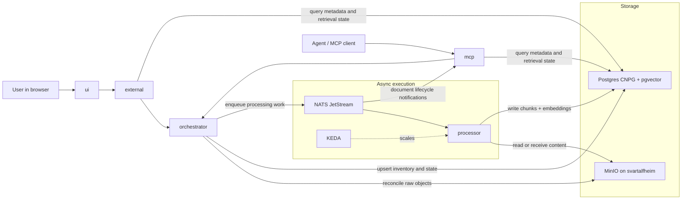

# RAG Direction

This repo is taking an async-first path to document ingestion and retrieval.

- MinIO remains the canonical raw object store
- Postgres is the source of truth for metadata, state, chunks, and embeddings
- NATS JetStream plus KEDA are the execution layer for asynchronous workers
- `orchestrator` owns control-plane reconciliation and task dispatch
- `processor` is the stateless worker for extraction, chunking, embedding, and persistence
- `external` and `mcp` are the stable public and AI-facing surfaces
- `mcp` should eventually forward document lifecycle notifications sourced from NATS JetStream to MCP subscribers

Near-term scope is the document, chunk, and embedding foundation.
CAG and graph-style knowledge layers are future phases built on top of that base rather than separate immediate datastores.

