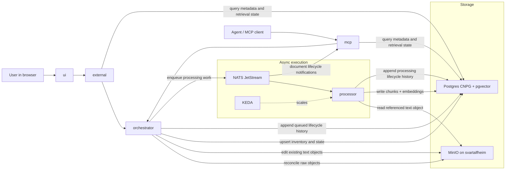

# RAG Direction

This repo is taking an async-first path to document ingestion and retrieval.

- MinIO remains the canonical raw object store
- Postgres is the source of truth for metadata, state, chunks, and embeddings
- Postgres also keeps durable document lifecycle history for processing attempts
- NATS JetStream plus KEDA are the execution layer for asynchronous workers
- `orchestrator` owns control-plane reconciliation and task dispatch
- `processor` is the stateless worker for extraction, chunking, embedding, and persistence
- `external` and `mcp` are the stable public and AI-facing surfaces
- `mcp` forwards document lifecycle notifications sourced from NATS JetStream to MCP subscribers

Near-term scope is the document, chunk, and embedding foundation.
CAG and graph-style knowledge layers are future phases built on top of that base rather than separate immediate datastores.

The current ingestion slice is reference-based:

- `orchestrator` accepts MinIO document references, not inline text payloads
- accepted documents are currently limited to `text/*`
- `rag.documents.status` moves through `pending`, `processing`, and `processed`
- `processor` reads the raw object from MinIO and writes chunks plus embeddings back to Postgres
- `external` exposes semantic search for the UI
- `mcp` exposes document inventory and semantic search for agents
- `external` and `mcp` expose context assembly that packages current-version search hits into a cited context block
- `external` and `mcp` allow retrieval to be narrowed by curated document metadata through exact-match JSON filters backed by a `rag.documents.metadata` JSONB GIN index
- `orchestrator` exposes document metadata curation for existing inventory rows
- `orchestrator` exposes text-object editing for existing inventory rows and queues a newer processing version after the raw object write
- `orchestrator` exposes explicit reprocessing for existing inventory documents through the same queue path
- `external` and `mcp` expose durable lifecycle history backed by `rag.document_lifecycle_events`
- `ui` renders durable lifecycle history for selected search results through `external`'s `/api/documents/history`
- retrieval responses search the document's current processed chunk version and include citation objects that identify the source URI and chunk identity for each match
- `local-embeddings` uses a built-in deterministic 384-dimensional embedding function when no external embedding endpoint is configured

