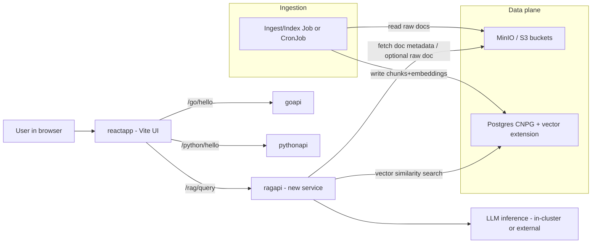

# RAG

```mermaid
flowchart LR
  U[User in browser] --> UI[reactapp - Vite UI];
  UI -->|/rag/query| RAG[ragapi - new service];
  UI -->|/go/hello| GO[goapi];
  UI -->|/python/hello| PY[pythonapi];

  subgraph Data plane
    MINIO[MinIO / S3 buckets];
    PG[Postgres CNPG + vector extension];
  end

  subgraph Ingestion
    ING[Ingest/Index Job or CronJob];
  end

  ING -->|read raw docs| MINIO;
  ING -->|write chunks+embeddings| PG;

  RAG -->|vector similarity search| PG;
  RAG -->|fetch doc metadata / optional raw doc| MINIO;
  RAG --> LLM[LLM inference - in-cluster or external];
```
