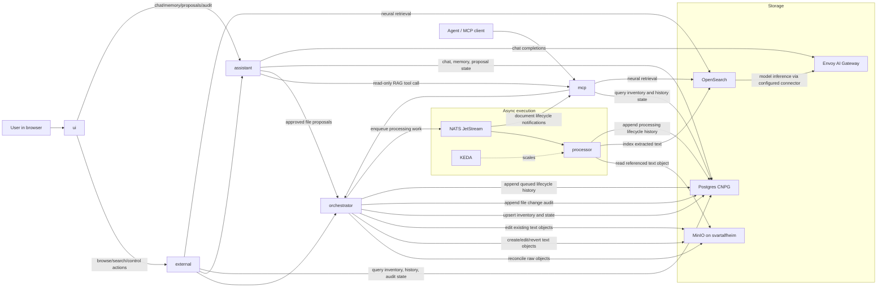

# RAG Direction

This repo is taking an async-first path to document ingestion and retrieval.

- MinIO remains the canonical raw object store
- Postgres is the source of truth for inventory, lifecycle, audit, assistant state, and workflow status
- OpenSearch is the source of truth for derived RAG chunks, vectors, indexing, and retrieval
- Envoy AI Gateway is the single app-facing inference governance and routing layer
- NATS JetStream plus KEDA are the execution layer for asynchronous workers
- `orchestrator` owns control-plane reconciliation and task dispatch
- `processor` is the stateless worker for extraction and OpenSearch-native indexing
- `external` and `mcp` are the stable public and AI-facing surfaces
- `assistant` is the browser-first LLM surface for RAG-backed chat, explicit per-user memories, file proposals, and audit views
- `mcp` forwards document lifecycle notifications sourced from NATS JetStream to MCP subscribers

The current scope is the document, chunk, embedding, retrieval, browser assistant, and MCP foundation.
CAG starts as explicit user-approved memory records assembled into the assistant prompt for the authenticated email; graph-style knowledge layers remain future phases built on top of the same base rather than separate immediate datastores.

The current ingestion slice is reference-based:

- `orchestrator` accepts MinIO document references, not inline text payloads
- accepted documents are currently limited to `text/*`
- `rag.documents.status` moves through `pending`, `processing`, and `processed`
- `processor` reads the raw object from MinIO, extracts text, and indexes it into OpenSearch through an ingest pipeline that performs native text chunking and model inference
- `external` exposes document inventory for browser operators to inspect reconciliation and processing state
- `external` exposes semantic search for the UI
- `mcp` exposes document inventory and semantic search for agents
- `external` and `mcp` expose context assembly that packages current-version search hits into a cited context block
- `external` and `mcp` allow retrieval to be narrowed by curated document metadata through exact-match JSON filters backed by a `rag.documents.metadata` JSONB GIN index
- `orchestrator` exposes document metadata curation for existing inventory rows
- `orchestrator` exposes text-object editing for existing inventory rows and queues a newer processing version after the raw object write
- `orchestrator` exposes explicit reprocessing for existing inventory documents through the same queue path
- `external` exposes browser-facing curation, guarded text edit, and reprocess proxy routes while leaving workflow ownership in `orchestrator`
- `external` proxies `/api/assistant/...` to the assistant service and forwards the authenticated browser identity
- `external` and `mcp` expose durable lifecycle history backed by `rag.document_lifecycle_events`
- `assistant` stores conversations, messages, tool calls, approved memories, and file-change proposals under the `assistant` Postgres schema
- `assistant` calls the read-only MCP `documents.context` tool to ground chat responses in current RAG data
- write-like assistant outcomes are persisted as proposals; approvals call `orchestrator` create/edit endpoints instead of letting the model write files directly
- `rag.document_change_audits` stores create/edit/revert audit rows linked to actor email, conversation ID, proposal ID, object key, MinIO version markers, and processing version
- MinIO versioning is enabled for the external `documents` bucket so approved revert operations can restore prior raw content and queue reingestion
- `ui` renders durable lifecycle history for selected search results through `external`'s `/api/documents/history`
- `ui` can assemble cited context blocks from the Search tab through `external`'s `/api/documents/context` using the same query, prefix, and metadata filters
- `ui` can inspect Postgres-backed inventory rows from the Inventory tab through `external`'s `/api/documents/inventory`
- `ui` can trigger prefix-scoped bucket reconciliation from the Inventory tab through `external`'s `/api/documents/scan-bucket`
- `ui` can load durable lifecycle history directly from Inventory tab rows through `external`'s `/api/documents/history`
- `ui` can update curated metadata directly from Inventory tab rows through `external`'s `/api/documents/curation`
- `ui` can perform guarded raw text edits directly from text Inventory tab rows through `external`'s `/api/documents/object` and `/api/documents/edit-text`
- `ui` can queue reprocessing for text Inventory tab rows through `external`'s `/api/documents/reprocess` and then load version-specific lifecycle history
- `ui` can update curated metadata, perform guarded raw text edits, and queue reprocessing for selected search results through `external` proxy routes
- `ui` automatically loads version-specific durable lifecycle history after browser actions that queue processing
- retrieval responses search OpenSearch nested chunk hits for the document's current indexed processing version and include citation objects that identify the source URI and chunk identity for each match
- OpenSearch owns chunk vectors through `text_chunking`, `ml_inference`, and neural search pipelines; the configured OpenSearch ML model is expected to call Envoy AI Gateway so backend providers can move from local/OpenSearch ML to Bedrock without app code changes
- known migration gap: OpenSearch-native chunking may initially have less precise HTML heading metadata than the old processor chunker until extracted section metadata is mapped cleanly into the OpenSearch ingest pipeline

File-type expansion beyond the current UTF-8 `text/*` baseline is intentionally gated by `docs/FileTypeExpansion.md`. HTML is now the first implemented extractor beyond plain text: it strips boilerplate markup, preserves visible text, records extraction warnings in lifecycle history, and attaches title/heading citation metadata without breaking existing text citations.

## Maintenance Focus

The active follow-up work is no longer to add separate RAG applications. The current maintenance focus is:

- keep the local vLLM plus Envoy AI Gateway smoke test green before promoting larger or quantized models
- keep improving assistant answer quality while preserving explicit memory, proposal-before-write approvals, scoped audit views, and read-only model tool use
- grow retrieval quality through `evals/ragas` gold cases before changing OpenSearch chunking, embedding dimensions, ranking, or metadata filter behavior
- follow `docs/FileTypeExpansion.md` before expanding beyond the current `text/*` ingestion path
- harden operations with runbooks, metrics, retention decisions, and recovery drills for Postgres, MinIO, NATS/KEDA, vLLM, and assistant workflows

## Chunking Evaluation

Use `evals/ragas` to score whether the current processed chunks retrieve the right gold context for representative queries.
The harness is currently a migration gap: it still reads the legacy Postgres `rag.chunks` and `rag.embeddings` rows. Before using it as a gate for the OpenSearch-native path, update it to query OpenSearch with the same neural search pipeline used by `external` and `mcp`.
Reports include citation-confidence fields for every retrieved chunk: source URI, object key, content type, chunk index, processing version, document metadata, chunk metadata, and the rendered citation label fields used by the UI and MCP surfaces.

Setup:

```bash
python3 -m venv .venv-ragas
. .venv-ragas/bin/activate
python3 -m pip install -r evals/ragas/requirements.txt
cp evals/ragas/chunking_cases.example.jsonl evals/ragas/chunking_cases.jsonl
```

Replace the example case with real JSONL rows. Each row should include a `query` plus `reference_context_ids`, `reference_contexts`, or both. Stable reference IDs use the citation format returned by search: `s3://documents/path/to/source.md#chunk-0`. Optional `prefix`, `documentId`, `metadata`, and `limit` fields use the same meaning as `documents.search`.
The local `chunking_cases.jsonl` file is ignored because gold cases can include private source excerpts.

Run it through the repo target, which reads the cluster Postgres credentials and opens a temporary port-forward:

```bash
make ragas-chunking-eval RAGAS_ARGS="--min-id-recall 0.8 --min-context-recall 0.8"
```

The script prints per-case RAGAS scores and returns a non-zero exit code when a configured threshold is missed. Use low thresholds such as `0.6` while building the first 5-10 private gold cases, then raise the regular gate toward `--min-id-recall 0.8 --min-context-recall 0.8` once the baseline is understood. Treat missing expected citation IDs, source URIs, processing versions, or chunk-level citation metadata needed for rendered labels as retrieval-quality regressions.


