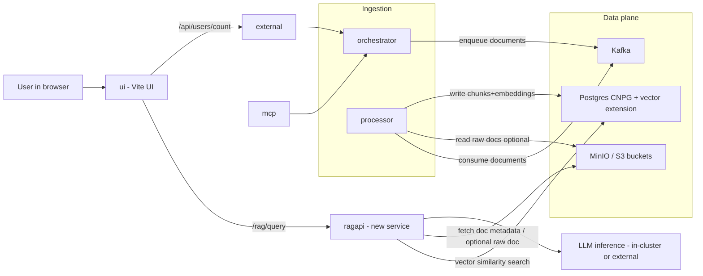

# RAG

```mermaid
flowchart LR
  U[User in browser] --> UI[ui - Vite UI];
  UI -->|/rag/query| RAG[ragapi - new service];
  UI -->|/api/users/count| EXT[external];
  EXT --> ORCH[orchestrator];
  MCP[mcp] --> ORCH;

  subgraph Data plane
    MINIO[MinIO / S3 buckets];
    PG[Postgres CNPG + vector extension];
    KAFKA[Kafka];
  end

  subgraph Ingestion
    ORCH
    PROC[processor];
  end

  ORCH -->|enqueue documents| KAFKA;
  PROC -->|consume documents| KAFKA;
  PROC -->|read raw docs optional| MINIO;
  PROC -->|write chunks+embeddings| PG;

  RAG -->|vector similarity search| PG;
  RAG -->|fetch doc metadata / optional raw doc| MINIO;
  RAG --> LLM[LLM inference - in-cluster or external];
```
